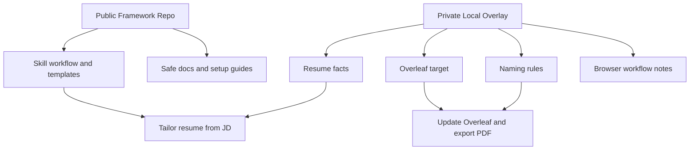

# Resume Overleaf Framework

This folder is the **public-safe GitHub package** for a resume-tailoring skill.

It is designed to publish the framework only:

- how to read a JD
- how to tailor a resume safely
- how to update Overleaf
- how to export and rename the final PDF

It does **not** include:

- personal resume facts
- names, emails, phone numbers, or locations
- private Overleaf project URLs
- browser-specific sessions
- any credentials or access details

## Architecture

## Recommended structure

Publish this folder as its own GitHub repository, or copy its contents into a fresh repo.

Do **not** publish the whole current local workspace, because that workspace may contain private local context and drafts.

## What users must add themselves

Before using this framework, each user should create their own local private files for:

- resume facts
- core/optional experience rules
- naming preferences
- Overleaf project URL
- local browser workflow details

See:

- `resume-overleaf-framework/references/private-config-template.md`
- `resume-overleaf-framework/references/resume-facts-template.md`

## Quick Start

1. Copy this repository locally.
2. Create your own private files from the templates in `resume-overleaf-framework/references/`.
3. Keep those private files outside Git or under a Git-ignored `private/` folder.
4. Point the workflow at your own Overleaf project and naming rules.
5. Install the skill locally in your own Codex skills directory.

See [LOCAL_SETUP.md](LOCAL_SETUP.md) for the local private overlay pattern.

## Suggested repo split

- Public GitHub repo:
  - framework only
  - no personal data
- Private local folder or private repo:
  - actual resume database
  - personal resume preferences
  - Overleaf target
  - browser-specific instructions

## License

This repository uses the MIT License. See [LICENSE](LICENSE).
